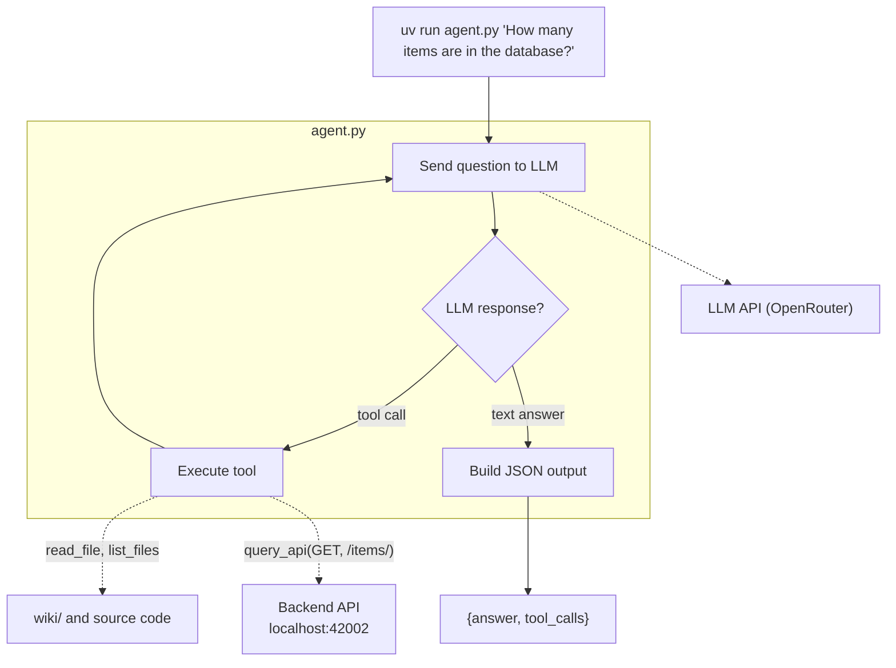

# The System Agent

In Task 1 you built an agent that reads documentation. But documentation can be outdated — the real system is the source of truth. In this task you will give your agent a new tool (`query_api`) so it can talk to your deployed backend, and teach it to answer two new kinds of questions: static system facts (framework, ports, status codes) and data-dependent queries (item count, scores).

## [Git workflow](../../../wiki/git-workflow.md)

1. Create an issue titled `[Task] The System Agent`.
2. Pull latest `main` from `origin` and `upstream`.
3. Create a branch from `main` (e.g., `task/system-agent`).
4. Work on the branch. Commit as you go using [conventional commits](https://www.conventionalcommits.org/) (e.g., `feat:`, `docs:`, `test:`).
5. Push, create a PR to `main` in **your fork** (not upstream). Link the issue using a keyword (e.g., `Closes #2`).
6. Get a review from your partner, merge (this closes the issue automatically), delete the branch.

## What you will build

You will add a `query_api` tool to the agent you built in Task 1. The agent can now reach your deployed backend in addition to reading files.



## CLI interface

Same as Task 1. The only change: `source` is now optional (system questions may not have a wiki source).

**Input:**

```bash
uv run agent.py "How many items are in the database?"
```

**Output:**

```json
{
  "answer": "There are 120 items in the database.",
  "tool_calls": [
    {"tool": "query_api", "args": {"method": "GET", "path": "/items/"}, "result": "{\"status_code\": 200, ...}"}
  ]
}
```

## New tool

You must implement one new tool and register it as a function-calling schema in your LLM request.

### `query_api`

Call your deployed backend API.

- **Parameters:** `method` (string — GET, POST, etc.), `path` (string — e.g., `/items/`), `body` (string, optional — JSON request body).
- **Returns:** JSON string with `status_code` and `body`.
- **Authentication:** use `LMS_API_KEY` from `.env.docker.secret` (the backend key, not the LLM key).

> **Note:** Two distinct keys: `LMS_API_KEY` (in `.env.docker.secret`) protects your backend endpoints. `LLM_API_KEY` (in `.env.agent.secret`) authenticates with your LLM provider. Don't mix them up.

## System prompt updates

Update your system prompt so the LLM knows:

- When to use wiki tools (questions about course concepts, documentation).
- When to use `query_api` (questions about the running system, live data, status codes).
- When to use `read_file` on source code (questions about implementation details like which framework, ORM, etc.).

## Deliverables

### 1. Plan (`plans/task-2.md`)

Before writing code, create `plans/task-2.md`. Describe:

- How you will define the `query_api` tool schema.
- How you will handle authentication (`LMS_API_KEY`).
- How you will update the system prompt so the LLM decides between wiki and system tools.

Commit:

```text
docs: add implementation plan for system agent
```

### 2. Tool and agent updates (update `agent.py`)

Update `agent.py` to:

- Define `query_api` as a function-calling schema.
- Implement the `query_api` function with authentication.
- Update the system prompt for system questions.

Commit:

```text
feat: add query_api tool for system queries
```

### 3. Documentation (update `AGENT.md`)

Update `AGENT.md` to document:

- **Tools:** what `query_api` does, its parameters, and authentication.
- **System prompt updates:** how the LLM decides between wiki and system tools.
- **Configuration:** the `LMS_API_KEY` environment variable needed for `query_api`.

Commit:

```text
docs: update agent documentation with system tools
```

### 4. Tests (5 tests)

Add 5 regression tests that verify tool calling works. Each test should:

- Run `agent.py` as a subprocess with a question that requires a tool.
- Parse the stdout JSON.
- Check that `tool_calls` is non-empty and contains the expected tool name.
- Check that the answer is reasonable.

Example test questions:

- `"What framework does the backend use?"` → expects `read_file` in tool_calls.
- `"What files are in the backend/app/routers/ directory?"` → expects `list_files` in tool_calls.
- `"How many items are in the database?"` → expects `query_api` in tool_calls.

Commit:

```text
test: add regression tests for system agent tools
```

### 5. Deployment

Deploy the updated agent to your VM.

Make sure:

- Both `.env.agent.secret` (LLM key) and `.env.docker.secret` (backend API key) are configured.
- The backend is running and reachable from `agent.py`.

### 6. Benchmark

Run `uv run run_eval.py` — it now includes system questions on top of wiki questions. When a question fails, the benchmark shows a **feedback hint** that guides you without revealing the exact expected answer.

## Acceptance criteria

- [ ] Issue has the correct title.
- [ ] `plans/task-2.md` exists with the implementation plan (committed before code).
- [ ] `agent.py` defines `query_api` as a function-calling schema.
- [ ] `query_api` authenticates with `LMS_API_KEY`.
- [ ] The agent answers static system questions correctly (framework, ports, status codes).
- [ ] The agent answers data-dependent questions with plausible values.
- [ ] `AGENT.md` documents the `query_api` tool and system prompt updates.
- [ ] 5 tool-calling regression tests exist and pass.
- [ ] The agent works on the VM via SSH.
- [ ] The benchmark passes all Task 1 and Task 2 questions locally.
- [ ] PR is approved and merged.
- [ ] Issue is closed by the PR.
